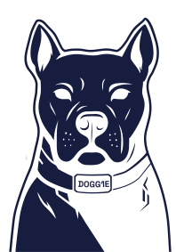

# Fork Overview

The branch [fix_slcan_command](https://github.com/ondrasy/fork_doggie/tree/fix_slcan_command) fixes the original repo when using on Linux with *slcand* and *ip* commands. I am not sure how the original repo was supposed to be used.

The branch [add_mcp2518_support] (https://github.com/ondrasy/fork_doggie/tree/add_mcp2518_support) adds support for an MCP2518FD module, but only in CAN 2.0 mode. Tested with (https://www.waveshare.com/wiki/2-CH_CAN_FD_HAT).

## Compilation and Installation

For my use case (Raspberry Pi Pico + MCP2515/MCP2518)

```bash
cd my_dir/doggie_pico
cargo run --release --bin doggie
```

## Usage

Start the *slcand*

```bash
sudo slcand -F /dev/ttyACM0 can0
```

Setup the communication (example)

```bash
sudo ip link set can0 type can bitrate 500000 listen-only off
sudo ip link set can0 up
```

Log the communication

```bash
candump -s 1 -l can0
```


# Doggie and evilDoggie Project Overview

<figure align="center">
    
</figure>

<figure align="center">
    
</figure>


**Doggie** is an open-source, modular project designed to build a DIY CAN Bus to serial adapter (USB, BLE, UART). It connects your computer to a CAN Bus network using the slcan protocol (CAN over Serial) for compatibility with tools like SocketCAN and Python-can. The project emphasizes modularity, supporting various microcontrollers (e.g., RP2040, STM32F103C8, ESP32) and CAN controllers (built-in or MCP2515).

**evilDoggie** is the offensive firmware variant of Doggie, tailored for automotive security research and low-level CAN Bus manipulation. It enables advanced attacks like spoofing, bus off, double receive, and physical-layer overrides, making it ideal for red teaming and vulnerability testing in simulated or real CAN environments.

Developed by Faraday Security, the project was presented at Black Hat Arsenal on August 6-7, 2025, in Las Vegas. Use responsibly for research and training only.

For detailed introductions, see the sub-sections for [Doggie](https://infobyte.github.io/doggie/software/doggie/intro) and [evilDoggie](https://infobyte.github.io/doggie/software/evil_doggie/intro).


## Disclaimer  
This project is a **work in progress**, and contributions are highly encouraged! While it is functional, some features may still be under development.  
If you encounter issues or have suggestions for improvements, please feel free to open an issue or submit a pull request.  

*⚠ Doggie and EvilDoggie tools are provided for educational and research purposes only.
By participating, you acknowledge that any testing, experimentation, or use of these tools on real vehicles or
production systems is solely your responsibility. The authors and organizers do not accept any liability for damage,
malfunction, legal consequences, or safety issues that may result from misuse, incorrect configuration, or applying
these techniques outside of a controlled environment.
Please use responsibly, and always test only on systems you own or have explicit permission to test.*

## License  
This project is licensed under the MIT License. See the [LICENSE](https://github.com/infobyte/doggie/blob/main/LICENSE) file for details.
