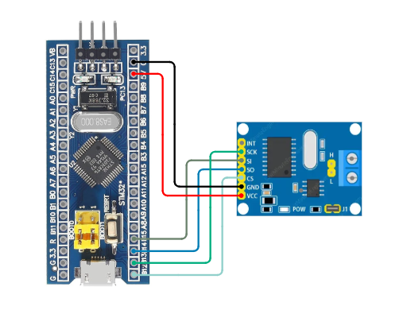
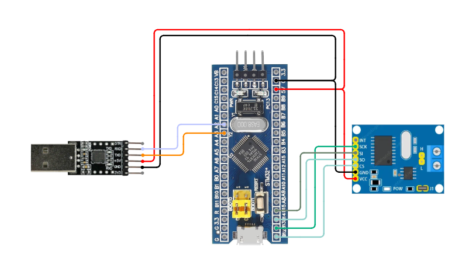
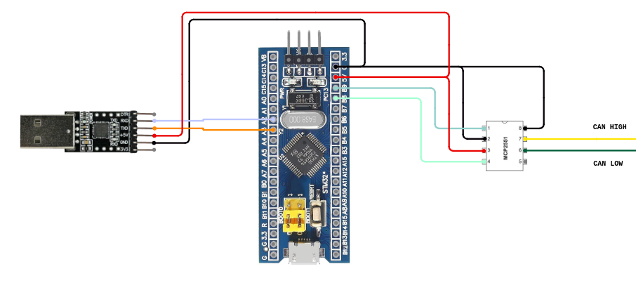

# Doggie Bluepill

## Features

In order to manage the compilation with different hardware variants we use the following features.

* `int`: Enable the internal CAN controller
* `mcp`: Enable the MCP2515 SPI interface as CAN controller
* `usb`: Use the USB as a serial interface
* `uart`: Use the UART as a serial interface

*NOTE: One, and only one, CAN interface feature must be enabled, and the same for the serial interfaces. Also, 'int' and 'usb' can't be enabled at the same time due to a hardware compatibility issue. By default, 'uart' and 'int' are enabled.*

1. Connect Bluepill to the programmer  

2. Build and flash with selected features
    * USB and MCP2515:
```
cargo run --bin doggie --release --no-default-features --features usb,mcp
```
  * UART and MCP2515:
```
cargo run --bin doggie --release --no-default-features --features uart,mcp
```
  * UART and internal CAN:
```
cargo run --bin doggie --release --no-default-features --features uart,int
```


## **Supported Configurations**

1. **USB and MCP2515 (SPI to CAN)**  
    - The **USB** port of the Bluepill is used for communication with the host system.  
    - The **MCP2515** (SPI to CAN) module is used for CAN Bus communication.  
    - This configuration allows the device to interface with a CAN network while communicating with the host via USB.

    __Connections__:  

    | Function |  Bluepill  | MCP2515 |
    | :------: | :--------: | :-----: |
    |   Vcc    |    5v      |    5v   |
    |   GND    |    GND     |    GND  |
    |   MOSI   |    PB15    |    SI   |
    |   MISO   |    PB14    |    SO   |
    |   Clock  |    PB13    |    SCK  |
    |   CS     |    PB12    |    CS   |

    

2. **UART and MCP2515 (SPI to CAN)**  
    - The **UART** port of the Bluepill is used to communicate with the host system.  
    - The **MCP2515** (SPI to CAN) module is used for CAN Bus communication.  
    - This configuration is useful when the USB port is unavailable or when using a serial connection instead of USB.

    __Connections__:  

    | Function |  Bluepill  | MCP2515 | USB-UART |
    | :------: | :--------: | :-----: | :------: |
    |   Vcc    |    5v      |    5v   |    5v    |
    |   GND    |    GND     |    GND  |   GND    |
    |   MOSI   |    PB15    |    SI   |    -     |
    |   MISO   |    PB14    |    SO   |    -     |
    |   Clock  |    PB13    |    SCK  |    -     |
    |   CS     |    PB12    |    CS   |    -     |
    |   TX     |    A2      |    -    |    RX    |
    |   RX     |    A3      |    -    |    TX    |   

    

3. **UART and Internal CAN Controller**  
    - The **UART** port of the Bluepill is used to communicate with the host system.  
    - The internal **CAN controller** of the STM32F103C8 microcontroller is used for CAN Bus communication and one tranceiver (MCP2551 in this case).  
    - **Note:** The Bluepill's **USB port** and **internal CAN controller** cannot be used simultaneously. If the internal CAN controller is selected, the only available communication interface with the host is **UART**.

    __Connections__:  

    | Function | Bluepill | MCP2551 | USB-UART |
    | :------: | :------: | :-----: | :------: |
    |   Vcc    |    5v    |    VDD  |    5v    |
    |   GND    |    GND   |    VSS  |   GND    |
    |   CAN TX |    B8    |    TX   |    -     |
    |   CAN RX |    B9    |    RX   |    -     |
    |   RS     |    GND   |    RS   |    -     |
    |   TX     |    A2    |    -    |    RX    |
    |   RX     |    A3    |    -    |    TX    |  

    

### Note on MCP2551 compatibility ###
There is no need to modify the MCP2551 standard module as the bluepill pins selected for the SPI are 5v tolerant.
