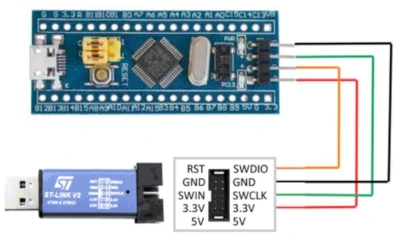

# **Bluepill**


## **Description**  

This implementation provides the hardware abstraction for **Doggie** and **evilDoggie** to run in the **STM32F103C8** microcontroller (commonly known as **Bluepill**).

## **Supported Configurations**

### Doggie

The Doggie Bluepill implementation supports **three configurations** for interacting with a CAN Bus network, enabling communication via USB or UART, while leveraging different CAN transceiver options.

1. **USB and MCP2515 (SPI to CAN)**
2. **UART and MCP2515 (SPI to CAN)**
3. **UART and Internal CAN Controller**


For a detailed documentation refer to the [Doggie on Bluepill documentation](./doggie.md)


### EvilDoggie

The code for the evilDoggie implementation is written but it is **not yet supported** as the memory requirements are not met.


## **How to flash a release using St-Link v2** ##

### Prerequisites ###

**Installing stlink tools**
```bash
sudo apt update
sudo apt install stlink-tools
```

Alternatively, build the tools from source (if you need the latest version):
```bash
git clone https://github.com/stlink-org/stlink.git
cd stlink
make release
sudo make install
```

## Preparing the Firmware
Ensure your firmware binary is compiled and ready to flash. You could download the release file `doggie_bluepill_{serial}_{can}` with the desired configuration from the [Release](https://github.com/infobyte/doggie/releases) page.

## Flashing the Firmware

1. Connect the ST-LINK programmer to your computer via USB.
    - `ST-LINK SWDIO` → `Bluepill SWDIO`
    - `ST-LINK SWCLK` → `Bluepill SWCLK`
    - `ST-LINK GND` → `Bluepill GND`
    - `ST-LINK 3.3V` → `Bluepill 3.3V` (if not powered externally)

    

2. Power the Bluepill (either through the ST-LINK or an external power source).
3. Open a terminal and navigate to the folder containing your downloaded firmware binary.
4. Flash the firmware using `st-flash`:
```bash
st-flash write doggie_bluepill_usb_mcp 0x8000000
```
Explanation:

   - `write`: Command to write the firmware.
   - `doggie_bluepill_usb_mcp`: The binary firmware file to be flashed.
   - `0x8000000`: Starting address of the STM32F103C8 flash memory.


## **How to Compile and Flash**

### **Prerequisites**  
1. Install **Rust** and **cargo** with support for ARM architecture.  
   Follow the installation instructions from the official [Rust website](https://www.rust-lang.org/tools/install).  


2. Add the target architecture:
```
rustup target add thumbv7m-none-eabi
```

3. Install `probe-rs`
```
curl --proto '=https' --tlsv1.2 -LsSf https://github.com/probe-rs/probe-rs/releases/latest/download/probe-rs-tools-installer.sh | sh
```

### **Compile and Flash the Firmware Using ST-Link V2:**

In order to compile for the bluepill, first we need to select the desired project with the `--bin ` flag (doggie or evil_doggie) and the desired features.

```
cargo run --bin {PROJECT} --release --no-default-features --features {FEATURES}
```