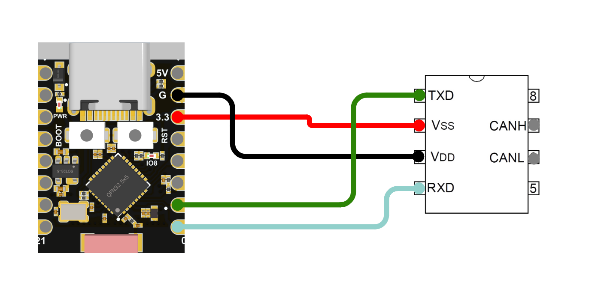

# evilDoggie #

evilDoggie supports only the `ble` features. And default, `ble` is enabled.

For example:
```
# evilDoggie on ESP32c3 with BLE
DEFMT_LOG=off cargo esp32c3 --bin evil_doggie

# evilDoggie on ESP32 without BLE
DEFMT_LOG=off cargo esp32 --bin evil_doggie --disable-default-features
```

## **Supported Configurations**

The ESP32 implementation supports only one configuration where the GPIOs are connected directly to a standard CAN Bus driver or the [evilDoggie custom driver](../../force.md).

To connect a standard driver we will only need two GPIOs (CAN TX, CAN RX), but for the custom driver, we will need one more GPIO (CAN FORCE).




__Connections__:

| Function  |   Driver   | Custom Driver |
| :-------: | :--------: | :-----------: |
| Vcc       |    VCC     |      VCC      |
| GND       |    GND     |      GND      |
| CAN TX    |    TX      |      TX       |
| CAN RX    |    RX      |      RX       |
| CAN FORCE |    -       |     FORCE     |


For each esp32 varian we will use different pins that are defined but they could be easily changed in the code. Some variants are not implemented but are compatible and will be implemented on demand.

__Connections variants__:

| Function    |   ESP32  | ESP32c3  |
| :---------: | :------: | :------: |
|  Vcc 3.3    |   3v3    |    3.3   |
|  Vcc 5v     |  VIN/5v  |    5v    |
|  GND        |   GND    |     G    |
|  CAN TX     |   26     |     1    |
|  CAN RX     |   25     |     0    |
|  CAN FORCE  |   27     |     10   |
| LOGS (UART) |   17     |     3    |
