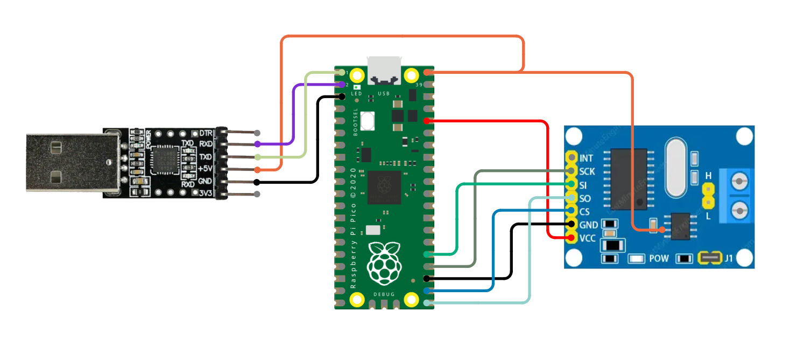
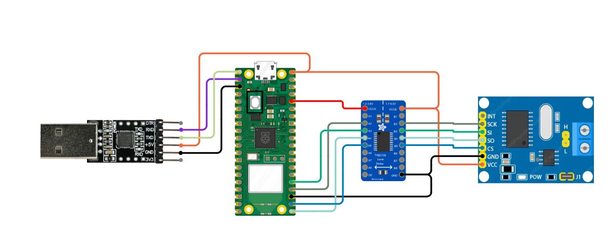

# evilDoggie #

evilDoggie supports only the `uart` feature, so it can be built and flashed using the following command:

```
DEFMT_LOG=off cargo run --release --bin evil_doggie --no-default-features --features=uart
```

## **Supported Configurations**
The Raspberry Pico implementation supports the following configuration.

As the RP2040 doesn't have 5v tolerant GPIOs, you shoud modify the MCP2515 or use a logic level shifter in order to make it compatible. Read [MCP2515 module compatibility note](../mcp.md) for more information.

1. **UART and MCP2515 (SPI to CAN)**
    - The **UART** port of the Pico is used to communicate with the host system.
    - The **MCP2515** (SPI to CAN) module is used for CAN Bus communication.
    - This configuration is useful when the USB port is unavailable or when using a serial connection instead of USB.

    __Connections__ (MCP2515 mod):

    | Function |   Pico   |    MCP2515     | USB-UART |
    | :------: | :------: | :------------: | :------: |
    |   Vcc    |   3.3    |       VCC      |    -     |
    |   Vcc 5v |   VBUS   | Tranceiver VCC |    5v    |
    |   MOSI   |   GP19   |       SI       |    -     |
    |   MISO   |   GP16   |       SO       |    -     |
    |   Clock  |   GP18   |       SCK      |    -     |
    |   CS     |   GP17   |       CS       |    -     |
    |   TX     |   GP0    |        -       |    RX    |
    |   RX     |   GP1    |        -       |    TX    |

    


    __Connections__ (MCP2515 with level shifter):

    | Function |   Pico   | Level Shifter | MCP2515 | USB-UART |
    | :------: | :------: | :-----------: | :-----: | :------: |
    |   Vcc    |   VBUS   |               |    VCC  |   GND    |
    |   GND    |   GND    |               |    GND  |    -     |
    |   MOSI   |   GP19   | <-----------> |    SI   |    -     |
    |   MISO   |   GP16   | <-----------> |    SO   |    -     |
    |   Clock  |   GP18   | <-----------> |    SCK  |    -     |
    |   CS     |   GP17   | <-----------> |    CS   |    -     |
    |   TX     |   GP0    |               |    -    |    RX    |
    |   RX     |   GP1    |               |    -    |    TX    |


    
