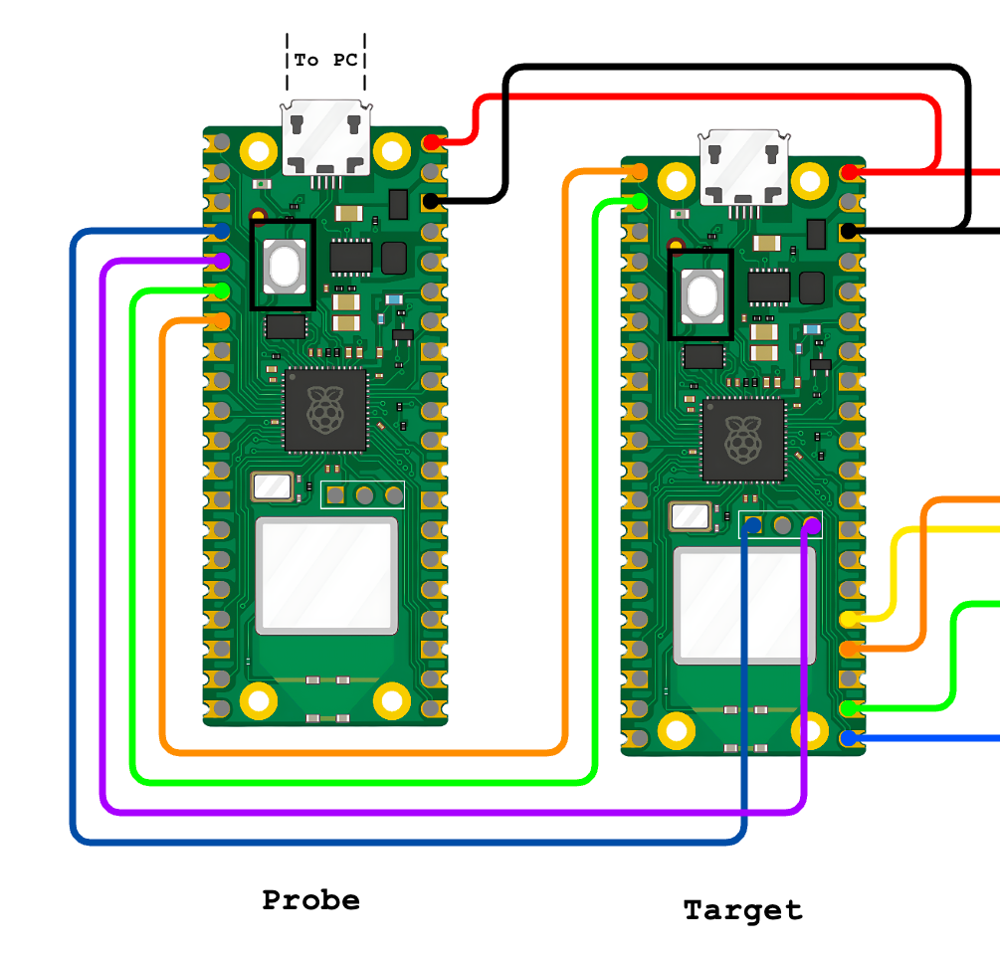

# **Doggie RP2040**

## **Description**
This implementation provides the hardware abstraction for **Doggie** and **evilDoggie** to run in the Raspberry Pi Pico RP2040 microcontroller family.

## **Supported Configurations**
### Doggie
The RP2040 implementation supports the following configurations.

1. **USB and MCP2515 (SPI to CAN)**
2. **UART and MCP2515 (SPI to CAN)**

For a detailed documentation refer to the [Doggie on RP2040 documentation](./doggie.md)

### evilDoggie
The ESP32 implementation supports only one configuration.

For a detailed documentation refer to the [evilDoggie on RP2040 documentation](./evil_doggie.md)

## **How to Flash a Release**
* USB and MCP2515:
    1. Download the release `doggie_pico_usb_mcp.uf2`.
    2. Connect the Pico in bootloader mode and copy the release.

* UART and MCP2515:
    1. Download the release `doggie_pico_uart_mcp.uf2`.
    2. Connect the Pico in bootloader mode and copy the release.

## **How to Compile and Flash**

### **Prerequisites**

1. Install **Rust** and **cargo** with support for ARM architecture.
    Follow the installation instructions from the official [Rust website](https://www.rust-lang.org/tools/install).

2. Add the target architecture:

    ```
    rustup target add thumbv6m-none-eabi
    ```

3. To program a Pico, you can put it in bootloader mode and copy the firmware or use another Pico as a probe.

    - If you want to program your Pico by copying the firmware, install `elf2uf2-rs`:

        ```
        cargo install elf2uf2-rs
        ```

    - If you want to program your Pico using another Pico as a probe, install `probe-rs`:

        ```
        curl --proto '=https' --tlsv1.2 -LsSf https://github.com/probe-rs/probe-rs/releases/latest/download/probe-rs-tools-installer.sh | sh
        ```

Additionally, you have to modify `doggie_pico/.cargo/config.toml`:

```
[target.'cfg(all(target_arch = "arm", target_os = "none"))']
# runner = "elf2uf2-rs -d"               # Program by copying firmware
runner = "probe-rs run --chip RP2040"  # Program with another Pico

[build]
target = "thumbv6m-none-eabi"          # Cortex-M0 and Cortex-M0+

[env]
DEFMT_LOG = "trace"
```

And setup a Pico as a probe by cloning the [RPI debug probe repo](https://github.com/raspberrypi/debugprobe), building it for the pico:
```
git clone https://github.com/raspberrypi/debugprobe.git
cd debugprobe
mkdir build
cd build
cmake -DDEBUG_ON_PICO=ON ..
make
```

Copying the resulting `.uf2` image to the probe Pico, and connecting it to the target Pico.

 __Connections__:

| Function |   Pico Probe   | Target Probe |
| :------: | :------------: | :----------: |
|  Vcc     |      VBUS      |     VBUS     |
|  GND     |      GND       |     GND      |
|  SWCLK   |      GP2       |     SWCLK    |
|  SWDIO   |      GP3       |     SWDIO    |
|  UART -> |      GP4       |     GP1      |
|  UART <- |      GP5       |     GP0      |



### **Compile and Flash the Firmware:**

1. Connect the target Pico to the PC in bootloader mode or to the probe as shown before.

2. Then we need to select the desired project with the `--bin` flag:

    * `doggie`
    * `evil_doggie`

3. And then we flash with:
```
DEFMT_LOG=off cargo run --release --bin {BIN} --disable-default-features --features {FEATURES}
```
