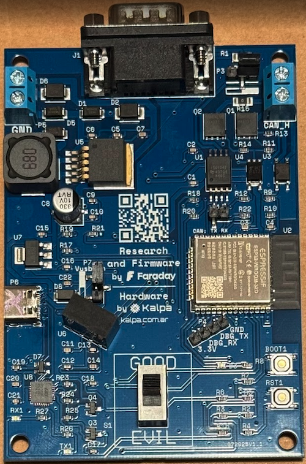

# Doggie/evilDoggie Board - Faraday Edition

## Introduction
The **Faraday Doggie & evilDoggie Board** is a professional-grade, dual-purpose CAN Bus adapter and research tool designed by [Faraday](https://faradaysec.com) in collaboration with [Kalpa](https://kalpa.com.ar). This board offers a readymade, plug-and-play solution for CAN Bus analysis and security research. The board's design allows it to function as both a standard **Doggie** CAN Bus adapter and an **evilDoggie** research and testing tool, switching between modes via a hardware toggle.

<figure align="center">
    
</figure>

## Hardware
The board uses a ESP32-WROOM-32D microcontroler with 8 Mb of flash, allowing it to store both Doggie and evilDoggie firmwares simultaneously. The switch labelled Evil/Good can be used to switch betweeen the firmware images. The eye color provides visual confirmation of the selected firmware image (red for evil and blue for good).

### CAN Bus Interface
The CAN communication stack comprises two critical components:

- ESP32 internal CAN-compatible controller (TWAI - Two-Wire Automotive Interface)
- External CAN tranceiver:
    - ISO1042DWVR Isolated CAN Transceiver
    - Galvanic isolation up to 2.5 kV for electrical protection
    - Enhanced ESD protection (±12 kV contact discharge)
    - Wide common-mode range (-12V to +12V) for automotive environments
    - Thermal shutdown protection and short-circuit immunity
    - Low electromagnetic emissions compliant with automotive EMC standards

### Connectivity Options

CAN Network Connection:

- Screw terminal blocks for internal bus connection or permanent installation
- DB9 connector for standard automotive/industrial applications
- DB9-to-OBD2 adapter compatibility for direct vehicle connection
- Jumper-selectable 120Ω termination resistor

Host Connection:

- USB-C connector with integrated USB-to-Serial bridge

### Power Management System

Power Source Selection:
- USB-C 5V Bus Power (Jumper in Vusb position)
- Automotive 12V Rail (via OBD2 or terminal block. Jumper not in Vusb position)
- External DC Supply (6V-24V via terminal block. Jumper not in Vusb position)

### Advanced Features

Dominant Override Circuit:

- Allows to force messages and custom states
- Custom fast-switching transistor implementation
- Essential for advanced security testing scenarios
- Electronically controlled via firmware commands

<figure align="center">
    
</figure>

The hardware bill of materials and schematics are available in the repo's hardware directory.


## How to flash it ##

In order to flash the board we need to follow the ESP32 Doggie and evilDoggie [instructions](./diy/esp32/intro.md) to install the ESP32 and Rust dependencies.

After installing the dependencies, we need to build two binaries with the board **disconnected**:

```
$ DEFMT_LOG=off cargo esp32 --bin evil_doggie --no-default-features --features twai,faraday

$ DEFMT_LOG=off cargo esp32 --bin doggie --no-default-features --features twai,faraday
```

This commands are going to fail with `Error: espflash::no_serial` and thats ok, we want to build the binaries and not flash them.

Now that the binaries are builded, it's time to flash them together on the board:
```
$ espflash flash --flash-size 8mb --partition-table bootloader/partitions.csv --bootloader bootloader/bootloader.bin --target-app-partition test target/xtensa-esp32-none-elf/release/doggie
$ espflash flash --flash-size 8mb --partition-table bootloader/partitions.csv --bootloader bootloader/bootloader.bin --target-app-partition factory target/xtensa-esp32-none-elf/release/evil_doggie
```

And you are ready to use the Faraday Doggie & evilDoggie board!
