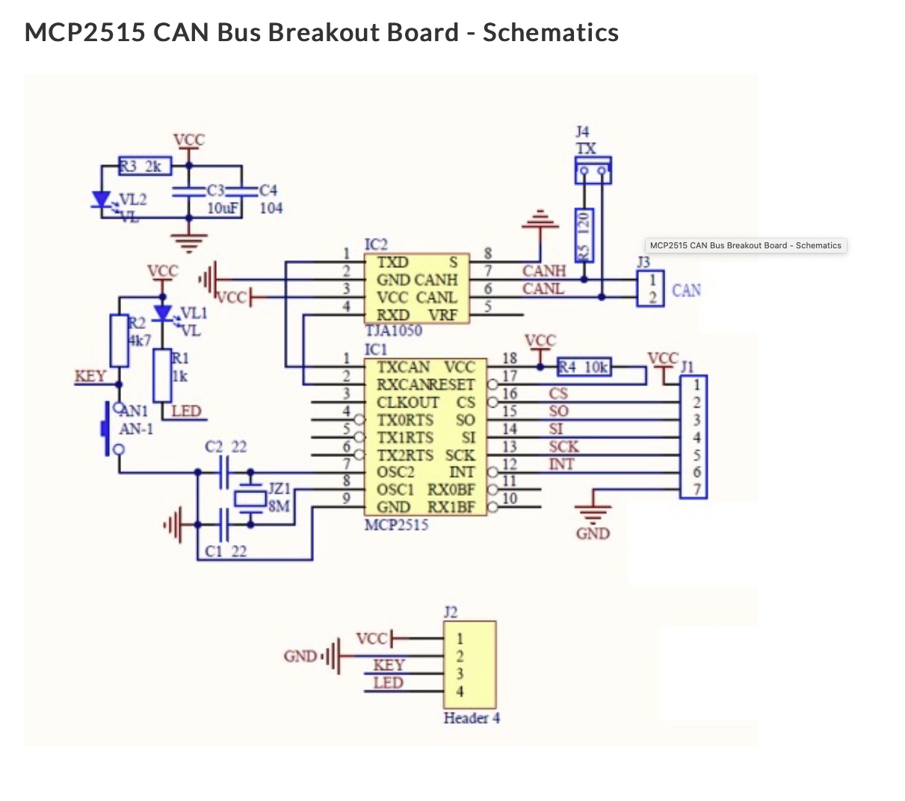

### MCP2515 Module Modification Guide

The project supports a variety of hardware configurations, but the most straightforward and widely recommended approach is to use the popular MCP2515 module in conjunction with a compatible microcontroller. While the MCP2515 module is a cost-effective and reliable choice for CAN Bus interfacing, it requires a specific modification to ensure seamless compatibility with most modern microcontrollers. This section explains the compatibility issue in detail, its root cause, and provides two practical solutions to address it.

#### Background: Understanding the MCP2515 Module
The MCP2515 module is a complete solution for CAN Bus communication, integrating two key components:
1. **MCP2515 CAN Bus Controller**: A standalone controller that communicates with a microcontroller via the Serial Peripheral Interface (SPI) protocol. It is responsible for managing CAN Bus data frames and can operate at either 3.3V or 5V logic levels.
2. **TJA1050 CAN Transceiver**: A high-speed transceiver that interfaces directly with the CAN Bus physical layer, converting the controller’s signals into the differential voltages required by the CAN protocol. The TJA1050, however, operates exclusively at 5V.

These components are typically sold pre-assembled on a single module, with both the MCP2515 controller and the TJA1050 transceiver sharing a single power pin (VCC). This design simplifies the module but introduces a compatibility challenge when interfacing with microcontrollers that operate at 3.3V, as explained below.

**Datasheet References**:
- MCP2515: [Link to MCP2515 Datasheet](https://ww1.microchip.com/downloads/en/DeviceDoc/MCP2515-Stand-Alone-CAN-Controller-with-SPI-20001801J.pdf)
- TJA1050: [Link to TJA1050 Datasheet](https://www.nxp.com/docs/en/data-sheet/TJA1050.pdf)

#### The Compatibility Issue
The MCP2515 module’s single VCC pin forces both the controller and transceiver to operate at the same voltage. While the MCP2515 can function at either 3.3V or 5V, the TJA1050 requires 5V to operate correctly. As a result, the module is typically powered at 5V to satisfy the transceiver’s requirements. However, this causes the MCP2515 to output 5V logic levels on its SPI pins (e.g., MOSI, MISO, SCK, and CS), which are used to communicate with the microcontroller.

Many modern development boards—such as the Raspberry Pi, Arduino models with 3.3V logic, or various ARM-based microcontrollers—operate at 3.3V and do not tolerate 5V logic levels on their GPIO pins. Applying 5V signals to a 3.3V microcontroller can damage the hardware or cause unreliable operation, rendering the unmodified MCP2515 module incompatible with these systems.

#### Solution 1: Using a Logic Level Shifter
The first and simplest solution is to retain the module’s default 5V power configuration and add a logic level shifter between the MCP2515 module and the microcontroller. This approach works as follows:
- **Power the MCP2515 Module at 5V**: Connect the module’s VCC pin to a 5V supply, ensuring both the MCP2515 controller and TJA1050 transceiver function correctly.
- **Add a Logic Level Shifter**: Place a bidirectional logic level shifter (e.g., based on a 74LVC series IC or a MOSFET-based shifter) between the SPI pins of the MCP2515 module (operating at 5V) and the microcontroller’s GPIO pins (operating at 3.3V). This converts the 5V logic signals from the MCP2515 to 3.3V signals compatible with the microcontroller, and vice versa.

**Advantages**:
- No physical modification to the module is required, preserving its original state.
- Straightforward to implement with widely available, inexpensive components.

**Disadvantages**:
- Adds extra hardware complexity and cost to the project.
- Requires careful wiring to ensure proper signal integrity.

**Implementation Steps**:
1. Power the MCP2515 module with a 5V supply.
2. Connect a logic level shifter to the SPI lines (MOSI, MISO, SCK, CS) between the module and the microcontroller.
3. Verify the shifter’s low-voltage side is connected to 3.3V and the high-voltage side to 5V, per the shifter’s specifications.
4. Test the setup to confirm reliable SPI communication.

#### Solution 2: Modifying the MCP2515 Module
A second, more hardware-oriented solution involves physically modifying the MCP2515 module to separate the power supplies for the MCP2515 controller and the TJA1050 transceiver. This allows the controller to operate at 3.3V (matching the microcontroller’s logic levels) while the transceiver remains at 5V. Here’s how it works:
- **Desolder the TJA1050 VCC Pin**: On the MCP2515 module, locate the TJA1050 transceiver’s VCC pin (typically connected to the module’s shared VCC line). Carefully desolder this pin to disconnect it from the module’s power rail.
- **Add a Separate 5V Supply**: Solder a small wire from the TJA1050’s VCC pin to an external 5V power source, ensuring the transceiver receives the required voltage.
- **Power the MCP2515 at 3.3V**: Connect the module’s VCC pin (now powering only the MCP2515 controller) to a 3.3V supply. This configures the MCP2515’s SPI pins to output 3.3V logic levels, making it directly compatible with 3.3V microcontrollers.

**Advantages**:
- Eliminates the need for an external logic level shifter, reducing component count.
- Provides a clean, direct 3.3V interface with the microcontroller.

**Disadvantages**:
- Requires soldering skills and careful modification of the module, which may risk damage if done incorrectly.
- Slightly more complex to document and replicate for end users.

**Implementation Steps**:
1. Identify the TJA1050 transceiver on the MCP2515 module and locate its VCC pin (refer to the module schematic or TJA1050 datasheet).
2. Using a soldering iron and desoldering tools (e.g., braid or pump), carefully lift the TJA1050 VCC pin from the shared power trace.
3. Solder a thin wire (e.g., 30 AWG) from the lifted VCC pin to a 5V power source.
4. Connect the module’s VCC pin to a 3.3V supply.
5. Verify the modification with a multimeter to ensure the MCP2515 receives 3.3V and the TJA1050 receives 5V.
6. Test the module with a 3.3V microcontroller to confirm SPI communication and CAN Bus functionality.

#### Recommendation

We recommend **Solution 2 (module modification)** as the preferred approach, as it aligns with the goal of creating a seamless, plug-and-play CAN Bus adapter compatible with a wide range of microcontrollers. While it requires more effort upfront, it simplifies the end-user experience by eliminating the need for additional components. However, for users uncomfortable with soldering, **Solution 1 (logic level shifter)** remains a viable alternative and should be documented as an option.

#### Conclusion
The MCP2515 module is an excellent choice for CAN Bus interfacing, but its default configuration poses a voltage compatibility challenge with 3.3V microcontrollers. By implementing one of the above solutions—either a logic level shifter or a physical modification—users can ensure reliable operation with the "Doggie" USB adapter. Both methods have been tested and validated for this project, and detailed schematics, photos, or diagrams of the modification process can be provided upon request.
