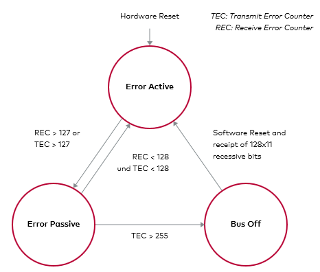
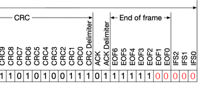
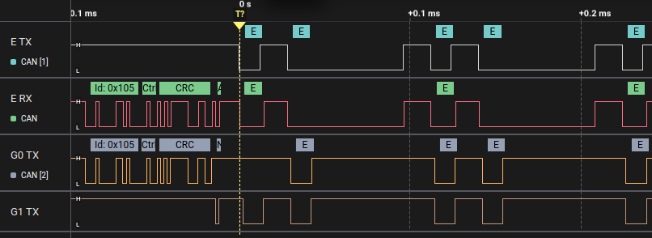

# Bus Off Attack

## Description

The `bus_off_attack` disrupts a target ECU by injecting a series of error frames upon detecting a matching message. This floods the bus, driving the target node's CAN controller into a "bus off" state (after 255 errors per CAN specification), effectively disabling or delaying its communication. Useful for silencing systems like ABS.

## Console Usage

1. Enter the main menu via the serial console.
2. Add the attack with `bus_off_attack <id> <errors> [ <match_data> ] [ --extended ]`.
       - Example: `bus_off_attack 0x105 50 0xFF`
           - Targets ID `0x105`, injecting 50 errors when data starts with `0xFF`.
3. Review the plan with `list`, then launch with `attack` (e.g., `attack 5` for 5 bursts).
4. Consult `help bus_off_attack` for additional options or clarification.

# Help

```
> help bus_off_attack

SUMMARY:
  bus_off_attack <id> <errors> [ <match_data> ] [ --extended ]

PARAMETERS:
  <id>
    CAN ID to match, in hex (e.g., 0x123, 0x12345678).

  <errors>
    Number of consecutive error frames to inject.

  <match_data>
    Match only after seeing a real message on the bus with the same ID and whose first data bytes match these comma‑separated hex values. Useful to target specific messages when multiple messages share the same ID.

  --extended
    Use if the target ID is an extended 29‑bit ID. Defaults to standard 11‑bit IDs.


DESCRIPTION:
Push a bus‑off attack that monitors the CAN bus and, when a matching message is detected, injects a burst of error frames timed to disrupt communication.

By sending repeated errors during transmission, this attack can force a target node’s CAN controller into a bus off state or significantly delay its messages, making it temporarily stop communicating or degrade its performance.
```

## How it works

The CAN protocol has built-in error detection and fault handling. When an ECU sends messages that keep failing to be acknowledged or keeps detecting errors, its transceiver’s error counters increase. After several consecutive errors, the ECU transitions into a bus off state, where it stops transmitting until it recovers.

The Bus Off Attack exploits this by injecting error frames at exactly the right moment in the CAN frame, right before the sender believes the message was correctly sent. This results in:

* The victim ECU thinking its messages are being rejected or corrupted.
* In consequence, the victim ECU either delays sending new messages (retrying) or fully stops after entering bus off.



The Bus Off Attack’s timing is similar to the Double Receive Attack, but here we deliberately corrupt the message so the receiver doesn’t get it either. We effectively silence the target ECU for a while.

This attack will insert the error frames after the EOF2 bit in the End Of Frame as we could see in the following image, disrupting the sended message.




For example, if we want to attack the messages with ID `0x105` we will do the following:

```
> bus_off_attack 0x105 50
```

And this will make a Bus Off Attack to a message with that id and inserting 50 error frames.

If we see the attack in a logic analyzer we could see the following:




Here, we have 3 devices involved, and the channels are:

* **E TX**: evilDoggie TX
* **E RX**: evilDoggie RX
* **G0 TX**: Doggie 0 TX 
* **G1 TX**: Doggie 1 TX

We can see that **G0** sends the message, **E** attacks.


## Implementation

**TODO**: High level commands that compose the attack
