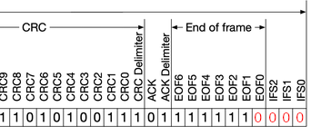

# Double Receive Attack

## Description

The `double_receive_attack` exploits CAN error handling by injecting timed error frames, causing the sender to retransmit while the receiver processes the initial frame. This results in duplicate message processing, potentially disrupting state machines or disabling features like airbags by confusing the ECU.

## Console Usage

1. Connect to the main menu via the serial console.
2. Add the attack with `double_receive_attack <id> <errors> [ <match_data> ] [ --extended ]`.
    - Example: `double_receive_attack 0x200 3 0x10`
        - Targets ID `0x200`, injecting 3 errors after data starting with `0x10` to trigger a double receive.
3. Check the plan with `list`, then execute with `attack` (e.g., `attack 1` for one attempt).
4. See `help double_receive_attack` for parameter specifics.

## Help

```
> help double_receive_attack

SUMMARY:
  double_receive_attack <id> <errors> [ <match_data> ] [ --extended ]

PARAMETERS:
  <id>
    CAN ID to match, in hex (e.g., 0x123, 0x12345678).

  <errors>
    Number of consecutive error frames to inject.

  <match_data>
    Match only after seeing a real message on the bus with the same ID and whose first data bytes match these comma‑separated hex values. Useful to target specific messages when multiple messages share the same ID.

  --extended
    Use if the target ID is an extended 29‑bit ID. Defaults to standard 11‑bit IDs.


DESCRIPTION:
Configure a double receive attack that injects error frames with precise timing to cause the sender to retransmit a frame while the receiver still accepts the first one.

This results in the receiver processing the same message twice, which can confuse state machines or logic relying on single delivery.
```

## How it works

This technique takes advantage of the fact that the sender and receiver rely on slightly different points of the CAN frame to confirm that the message was successfully sent. After the 6th bit of the EOF field in the CAN frame, the receiver already thinks the frame is valid and accepts it, but the sender waits until after the 7th bit to confirm transmission.

If you inject an error frame at exactly the right moment, the receiver will have already accepted the message, but the sender will think there was an error and resend it. The effect is that the receiver sees the same message twice, while the sender believes it has only sent it once.



For example, if we want to attack a message with id `0x102` and the first byte with `0x2` inserting only one error, we use the following command:

```
> double_receive_attack 0x102 1 0x2
> attack
```

If we see that in the logic analyzer we will see the following:


Here, we have 3 devices involved, and the channels are:

* **E TX**: evilDoggie TX
* **E RX**: evilDoggie RX
* **G0 TX**: Doggie 0 TX 
* **G1 TX**: Doggie 1 TX

We can see that **G0** sends the message, **E** injects an error frame in time and **G0** sends the message again. Notice that **G1** ACKs both messages.

## Implementation

Like all the attacks, the Double Receive Attack is built on top of attack primitives, but the primitives may change depending on the attack arguments used.
Let's see the primitives involved in the example:

1. First warm up the attack machine
    * **WarmUp**
2. Then try to match the id 0x102
    * **MatchId**
        - id: Standard(StandardId(0x102))
        - rtr: false
3. If it matches, try to match the data with 0x02
    * **MatchData**
        - data: [2, 0, 0, 0, 0, 0, 0, 0]
        - match_size: 1
4. Skipes the CRC and ACK fields
    * **Wait**
        - bits: 15
5. It will now wait until the desired bit to change
    * **SetBitstuffing**
        - state: false
    * **Wait**
        - bits: 9
    * **SetBitstuffing**
        - state: true
6. Sends the desired amount of error frames
    * **SendError**
        - amount: 1
