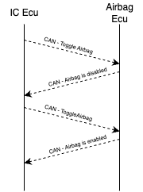
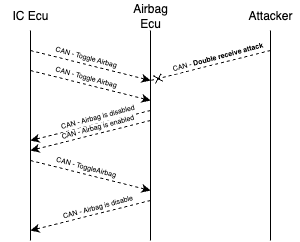
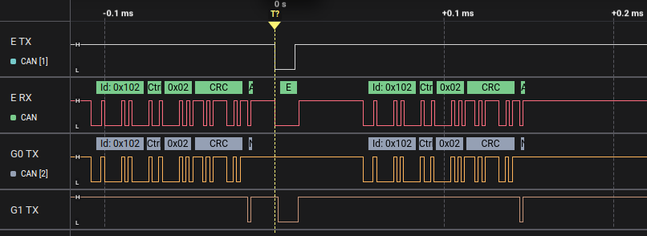

# Airbag Toggle Inversion
In this challenge, your objective is to create a confusing and dangerous mismatch between what the Instrument Cluster ECU shows on the UI and the real airbag state. Specifically, you want the dashboard to indicate that the airbag is enabled, while in reality, it is disabled.

The car’s airbag can be controlled through the Instrument Cluster UI, which has a toggle button. When someone presses this button, the Instrument Cluster ECU sends an *AirbagToggleMessage* to the Central ECU, which toggles the state of the airbag. The Central ECU then periodically sends back an AirbagStatusMessage, which the Instrument Cluster uses to display the current state of the airbag.

Your goal is to exploit how the toggle mechanism works so that the driver sees the airbag light on (believing the airbag is active) even though it is off.

## Hints
Let’s look at how the airbag system communicates in the simulator and why this kind of desynchronization is possible.

When the driver clicks the airbag toggle button on the dashboard, the Instrument Cluster ECU sends an *AirbagToggleMessage**:

- CAN ID: 0x102
- Data: single byte 0x2 (always the same)

The Central ECU doesn’t care about the data content; it simply interprets this message as a “toggle” command. Since it’s a toggle, pressing the button again sends the same message, flipping the airbag state.

The Central ECU then periodically broadcasts the *AirbagStatusMessage* so the Instrument Cluster can display whether the airbag is actually on:

- CAN ID: 0x100
- Data: first byte 0x4, second byte 0 if airbag is active, non-zero otherwise

<figure align="center">
    
</figure>

The UI shows the airbag light based on this status message, and keeps the toggle button in sync with the last action.

The problem here is that the toggle message doesn’t directly say “enable” or “disable”. It just means “flip the current state.” This makes the system vulnerable to certain timing attacks.

The attack you’ll use here is called a Double Receive attack. This technique takes advantage of the fact that the sender and receiver rely on slightly different points of the CAN frame to confirm that the message was successfully sent. After the 6th bit of the EOF field in the CAN frame, the receiver already thinks the frame is valid and accepts it, but the sender waits until after the 7th bit to confirm transmission.

If you inject an error frame at exactly the right moment, the receiver will have already accepted the message, but the sender will think there was an error and resend it. The effect is that the receiver sees the same message twice, while the sender believes it has only sent it once.

Since the *AirbagToggleMessage* is just a toggle, receiving it twice flips the airbag state twice: from enabled to disabled, and then back to enabled — but the rest of the system, including the Instrument Cluster UI, becomes unsynchronized. This creates the illusion on the dashboard that the airbag is enabled while it’s disabled.

<figure align="center">
    
</figure>

## Solution
Here’s how to do this step by step with evilDoggie. The serial interface allows you to configure built-in attacks. To set up a double receive attack, use:

`> double_receive_attack 0x102 1 0x2`

- **0x102** is the CAN ID of the *AirbagToggleMessage** sent by the Instrument Cluster
- **1** means inject one error frame (enough to cause the double receive effect)
- **0x2** ensures the attack only triggers on *AirbagToggleMessages* (ignores other messages with the same ID)

After setting up the attack, launch it:

`> attack`

The attack waits passively until it sees a message matching your filter: an *AirbagToggleMessage* with data byte 0x2. So now you need to press the airbag toggle button on the simulator UI (or ask someone to do it).

If the attack succeeds:

- evilDoggie’s console will log that the double receive attack was launched
- The Instrument Cluster will show the airbag light as enabled, but the toggle button itself will look disabled
- Pressing the toggle button again will reverse the effect: the toggle appears enabled, but the airbag light shows disabled

This demonstrates how you managed to desynchronize the ECU’s actual state from what the dashboard displays, inverting the real safety status of the airbag.

### Observe the result in the logic analyzer (optional)
Connect you logic analyzer to evilDoggie's CAN Tx and Rx pins (E TX and E RX), and to the Tx pins of the other two interfaces (G0 TX and G1  TX).

You should see how evilDoggie injects an error just after the 6th bit of the EOF field in the CAN frame corresponding to the *AirbagToggleMessage*. The receiver interface thinks the frame is valid and sends ACK, but the sender interface waits until after the 7th bit to confirm transmission and thinks it failed. In consequence, it sends it again:

<figure align="center">
    
</figure>

For information about CAN protocol and CAN message structure, you can check the Appendix at the end of this guide.
