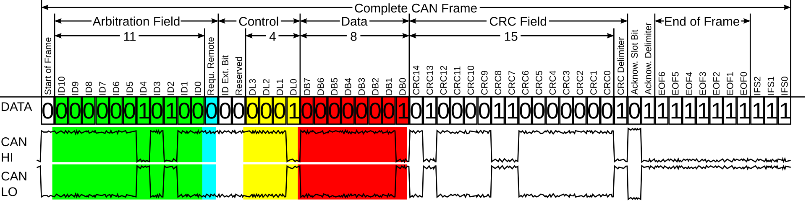
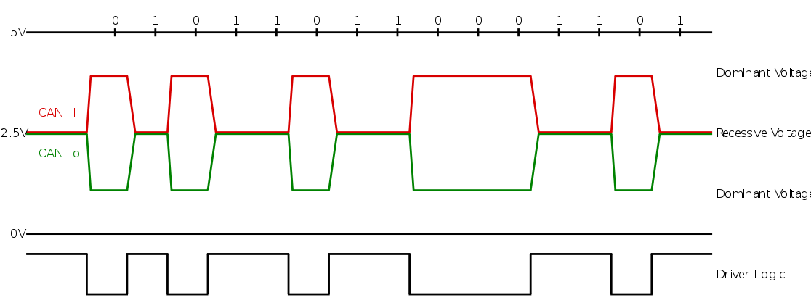

# Appendix: CAN Protocol
The Controller Area Network (CAN) was created by Bosch in the mid-1980s, first released in 1986. At that time, car manufacturers needed a communication protocol that could survive noisy environments, guarantee real-time data delivery, and keep costs low. CAN Bus solved these challenges and quickly became the de facto standard for connecting electronic control units (ECUs) inside vehicles: engine control modules, airbags, dashboards, door modules, and many others. Today, it’s still the backbone of most modern cars and also finds applications in robotics, industrial machinery, medical equipment, and even satellites.

At its core, CAN is a broadcast protocol where every node connected to the bus sees every message sent. Instead of using addresses like classic networking, CAN uses IDs: each message has an identifier that also defines its priority on the bus, lower numbers mean higher priority. The protocol is fast, simple, and extremely robust. Classic CAN carries up to 8 bytes of data per message, which is enough for most automotive control signals.

## CAN Frame Format
A CAN frame is more than an ID and data. It’s built from several parts that make it reliable on noisy hardware:

- **Start of Frame (SOF)**: Always dominant, signals the start.
- **Identifier (ID)**: 11 bits (standard) or 29 bits (extended); defines the message and its priority.
- **Control**: Includes the Data Length Code (DLC) that says how many bytes of data follow.
- **Data**: 0–8 bytes of payload in classic CAN.
- **CRC**: A cyclic redundancy check to detect errors.
- **ACK**: Receivers confirm they got the message.
- **End of Frame (EOF)**: Marks completion of the message.

<figure align="center">
    
</figure>

## Bitstuffing
One of the elegant features of CAN is bit stuffing. To keep all devices on the bus synchronized, the transmitter automatically inserts a bit of the opposite polarity every time it sends five identical bits in a row. The receiver knows to remove these extra bits. This mechanism ensures there are enough electrical transitions to keep everyone in sync, even if the actual data stays the same for a while.

## The physical layer
Physically, CAN Bus uses two wires: CAN High and CAN Low. When both wires carry the same voltage, that’s a recessive bit (1). When there’s a voltage difference between them, that’s a dominant bit (0). Dominant bits override recessive ones: this is what allows multiple nodes to try sending at the same time, and the highest-priority message to “win” on the bus.

<figure align="center">
    
</figure>

## Conclusions
Because CAN Bus was designed to be simple, fast, and robust, it doesn’t include built-in security features like encryption or authentication. Every message is trusted by default, and any node on the bus can send messages. That makes it a perfect environment to explore and learn about real-world automotive vulnerabilities.

Understanding these fundamentals, how frames are built, how bit stuffing keeps the bus synchronized, and how the physical layer prioritizes dominant bits, is essential before diving into offensive techniques. And that’s exactly why we’ll use tools like Doggie and EvilDoggie to see how these protocol details can be turned into practical attacks.
