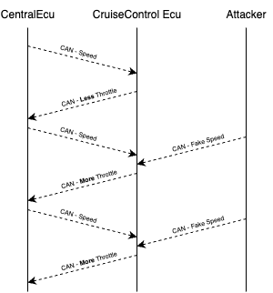
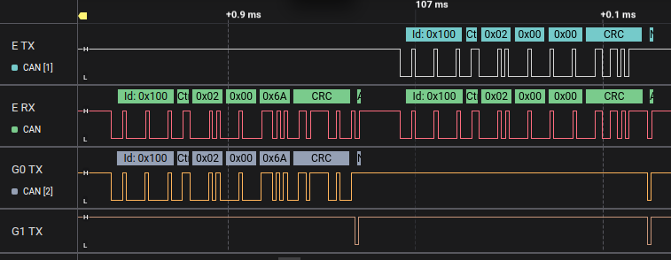

# Cruise-Control Confusion
In this challenge, your goal is to confuse the Cruise Control ECU so that it applies full throttle, even when the car is already moving, by making it think the car’s speed is 0 km/h.

Instead of just sniffing or sending normal messages, here you’ll need to use EvilDoggie, the offensive firmware variant of Doggie. You’ll apply a classic attack known as spoofing, where the attacker quickly injects fake messages to override real data on the bus.

## Hints
### How does the Cruise Control system work?
The Cruise-Control ECU (CC ECU) has its UI to let the driver enable, disable, or change the desired speed. To decide how much throttle to apply, the CC ECU needs to know the current car speed.

The Central ECU sends this info periodically using a *SpeedStatusMessage*:

- CAN ID: 0x100
- Data: [0x2, HIGH_DATA, LOW_DATA]
    - 0x2 → type of the message
    - HIGH_DATA and LOW_DATA → the actual speed (as a 16-bit value)

The CC ECU uses this speed info and sends back a *CruiseControlMessage*:

- CAN ID: 0x104
- Data:
    - One byte with 0 if CC is disabled, otherwise enabled.
    - A single byte (0–100) representing the throttle the CC wants to apply

The Central ECU reads this and adjusts the engine throttle to keep the car at the desired speed.

### Attack idea ###
If we can fool the CC ECU into thinking the speed is lower than it is (ideally, 0 km/h), it will try to accelerate to reach the desired speed:

- The car is already moving (speed > 0)
- CC ECU sees (wrongly) that speed = 0
- CC ECU sends a full-throttle CruiseControlMessage to the Central ECU

**Why spoofing works?**

The CC ECU processes the speed message in two steps:

- Receives the SpeedStatusMessage
- Reads and processes the most recent speed value

If we:

- Wait for the real SpeedStatusMessage from the Central ECU
- Immediately send our own fake SpeedStatusMessage with speed = 0

...then the CC ECU might read our spoofed value instead of the real one.

**How does evilDoggie help?**

EvilDoggie provides a special **spoofing_attack** command that waits for a message that matches specific conditions and quickly sends a fake message with the same ID to override it

<figure align="center">
    
</figure>

## Solution
### Use Evil mode

If you are using Faraday's board, set the switch to EVIL, reset the board or connect to it, and follow the Get Started for Evil Mode. If you are using a custom board, flash evilDoggie firmware.

### Configure the spoofing attack

We want to spoof:

- Message ID: 0x100 (*SpeedStatusMessage*)
- Only when the first byte (0x2) matches (this filters out other messages on the same ID)
- Send a fake message with speed = 0 (0x2, 0x0, 0x0)

So, in the EvilDoggie terminal send:

`> spoofing_attack 0x100 0x2,0x0,0x0 0x2`

- *0x100*: CAN ID
- *0x2,0x0,0x0*: data to spoof
- *0x2*: only trigger spoof when the first byte is 0x2

### Run the attack multiple times

We want to confuse the CC ECU repeatedly, so run:

`> attack 20`

This means EvilDoggie will run the spoofing attack 20 times consecutively.

## Observe the result

While the attack is running:

- On the simulator UI, the Instrument Cluster will temporarily show a speed of 0 km/h
- The CC ECU, seeing 0 km/h and a desired speed > 0, will send a full throttle request (0x104 message with data = 01 64). We will see the throttle at 100% but the speed gauge at 0 km/h.
- After the attack ends, the actual speed shoots up as we stop spoofing, and the throttle goes to 0% as the CC ECU now knows the actual speed.

Congratulations! You’ve successfully used EvilDoggie’s spoofing attack to manipulate real-time CAN Bus traffic, fooling an ECU into making the car go full throttle.

## Observe the result in the logic analyzer (optional)

Connect you logic analyzer to evilDoggie's CAN Tx and Rx pins (E TX and E RX), and to the Tx pins of the other two interfaces (G0 TX and G1  TX).

You should observe one interface sending the real speed message and the other interface sending the ACK. The evilDoggie sees both the original message and the ACK, and right after sends the spoofed message, which is ACK’ed by the interfaces as shown below:

<figure align="center">
    
</figure>
