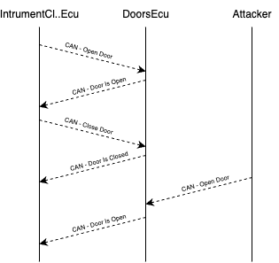

# Open sesame
Your goal: unlock only the front left door of the simulated car, not by clicking the button on the UI, but by sniffing the CAN Bus traffic to find which messages control the doors, and then injecting your own crafted message onto the bus.

This is the first “real attacker” challenge: you’ll watch the traffic, figure out what’s going on, and then directly control part of the car.

## Hints
### Which ECUs are involved?
For door locking, two ECUs talk to each other:

- Instrument Cluster ECU (ICE):
    - Handles UI buttons like lock/unlock
    - Sends commands to other ECUs
- Doors ECU (DE):
    - Receives commands from ICE
    - Locks/unlocks doors

Periodically sends back the current door status so the ICE can update the lights indicator in the UI

### How does the normal flow look?

1. You click (or ask to) “unlock” doors on the UI (ICE)
2. ICE sends a *DoorControlMessage* on the CAN Bus
3. Doors ECU sees this message and unlocks the doors
4. Doors ECU sends back a *DoorStatusMessage* to ICE, which updates the dashboard lights

As an attacker, you can see both messages on the CAN Bus, and you can inject your own *DoorControlMessage* to control the doors directly.

<figure align="center">
    
</figure>

### About the CAN messages

There are two message types to watch for (with fixed CAN IDs):

| Type | CAN ID | Data |
|------|--------|------|
| DoorControlMessage | 0x102 | 3 bytes: [command_type (0x1), lock/unlock, door mask] |
| DoorStatusMessage | 0x103 |  1 byte: door mask |

**Lock/unlock**: 1 = lock, 0 = unlock

**Door mask**: 4 bits, each bit represents a door.

### Tools you’ll use

- **cansniffer**: a powerful tool to spot changing fields and patterns in live traffic
- **candump**: simpler raw dump of all traffic
- **cansend**: to inject your crafted message

### What to do, step by step

1. Start by sniffing: run cansniffer while you lock/unlock doors from the UI
2. Observe which messages appear or change when you press the button
3. Identify:

    - DoorControlMessages: sent from ICE to DE
    - DoorStatusMessages: sent from DE to ICE

4. Once you know the structure, craft your own DoorControlMessage to control exactly what you want.

## Solution
### Start sniffing the traffic
Run:
`cansniffer -c doggie`

Where the arguments have the following meaning:

- **-c**: color mode (highlights changes)
- **doggie**: your CAN interface

### Press lock/unlock on the simulator UI

Watch the traffic. You’ll see CAN ID 0x102 messages with 3 data bytes:

- First byte: always 0x1 (command type)
- Second byte: changes when you lock/unlock
- Third byte: this is the door mask

For example:

- 0x102#01010F → lock all doors (mask: 00001111)
- 0x102#01000F → unlock all doors (mask: 00000000)

### Understand the door mask

- Each bit in the third byte represents a door
- Bit order: FR FL RR RL
- To unlock only the front left door (FL):
    - Set only bit 2 → 00000100 → 0x04

### Inject your crafted message
Use cansend: `cansend doggie 102#010004`

- **102**: CAN ID
- **#**: separates ID from data
- **010004**: data bytes → command type 0x1 + unlock + door mask 0x04

### Check the result

You should see the Doors ECU reply with a DoorStatusMessage (0x103) showing the new door status. On the simulator UI, only the front left door light shows as unlocked.

You just directly controlled a single door by sniffing and injecting CAN traffic!
