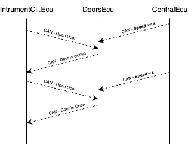
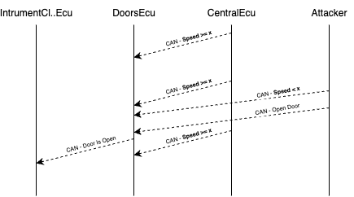
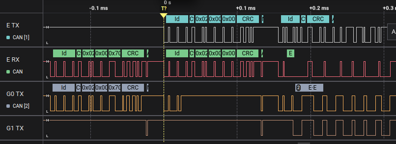
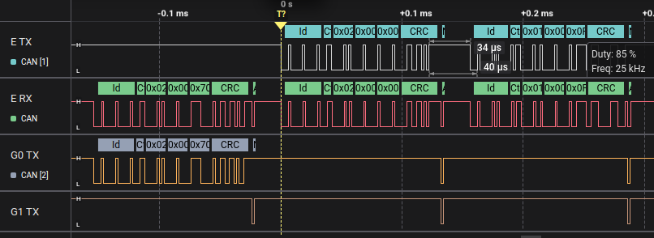

# Open Sesame on the Highway
In this challenge, you have to unlock a door while the car is moving at high speed.
This sounds similar to the second challenge, where you sniffed and injected a DoorControlMessage to open the front left door. But this time, it’s harder: the Doors ECU now knows the current speed of the car, and if the speed is above a certain threshold, it refuses to unlock the doors, even if it receives the correct unlock message.

Your goal is to find a way to trick the Doors ECU into thinking the car is moving slowly, so you can still unlock the door.

## Hints
Let’s review what happens inside the simulator and why the old attack won’t work anymore.
The Doors ECU works just like before: it listens for DoorControlMessages with CAN ID 0x102. When it gets a message, it unlocks or locks the doors according to the mask in the message. But now the car is moving, and it also listens to the same SpeedStatusMessage sent by the Central ECU that the Cruise Control ECU reads. This message:

- Has CAN ID 0x100
- Has data starting with byte 0x2, followed by two bytes representing the current speed

If the speed reported in that message is too high, the Doors ECU ignores any unlock command it receives.

<figure align="center">
    
</figure>

The normal injection you used in challenge 2 (just sending a *DoorControlMessage*) won’t work anymore, because now the car is moving, and the Doors ECU has extra logic that checks the speed before unlocking the door.

To bypass this, you need to combine two ideas:

- Use a spoofing attack (like in challenge 3) to send a fake *SpeedStatusMessage* with speed = 0 or another low value, just after the real one.
- Right after the spoofed speed message, send a *DoorControlMessage* to unlock the door.

If the timing is right, the Doors ECU will read the fake speed and then accept your unlock command, even if the real car speed is high.

<figure align="center">
    
</figure>

## Solution
Here’s how to build and run this attack step by step with evilDoggie.

First, open EvilDoggie in your terminal. You’ll see a prompt where you can enter attack commands. The first part of the attack plan is to spoof the *SpeedStatusMessage* with low-speed data, just like before:

`> spoofing_attack 0x100 0x2,0x0,0x0 0x2`

This means:

- Watch for a real message with ID 0x100 and first byte 0x2
- Immediately send a fake message with ID 0x100 and data 0x2,0x0,0x0 (speed = 0)

The second part is to send our unlock command. We’ll do this using a custom attack, so we can insert it exactly where we want. Type:

`> custom_attack`

This opens a new menu. Inside it, write:

`custom_attack> send_msg 0x102 0x1,0x0,0xf`

Here:

- **0x102** is the CAN ID for DoorControlMessage
- **0x1** is the command type
- **0x0** is unlock
- **0xf** is the door mask: unlock all doors (you could also use 0x4 to unlock only the front left door)

Then type:

`custom_attack> save`
`custom_attack> exit`

This saves the custom command and goes back to the main menu. Now your attack plan has two steps: first, spoofing the speed, then sending the unlock command. You can run “list” to see your attack plan and check that it looks correct.

Finally, launch the attack with:

`> attack`

When you run the attack, EvilDoggie will wait for a real SpeedStatusMessage with first byte 0x2, spoof a fake speed = 0, and then send the unlock message. As a result, the Doors ECU will see a low speed message just before the unlock command and will accept it, even though the car is moving fast. On the simulator UI, you’ll see the door unlock light turning on, proving that the attack worked.

Note that this attack can fail because our door unlock message can collide with other messages with higher priority, resulting in a bus error. If the attack doesn’t work, just attack again until you succeed.

This can be avoided using the bus takeover feature of EvilDoggie. By taking full control of the bus and silencing other ECUs, the attacker can ensure that their messages are always sent successfully. Don’t worry too much about this now, since this challenge can be solved without it. You will use this type of attack in the last challenge.

### Observe the result in the logic analyzer (optional)
Connect you logic analyzer to evilDoggie's CAN Tx and Rx pins (E TX and E RX), and to the Tx pins of the other two interfaces (G0 TX and G1  TX).

A failed attack attempt looks like this:

<figure align="center">
    
</figure>

Notice how an interface tries to send a message with higher priority, just as the evilDoggie is trying to send a door unlock message. This results in a bus error.

And a successful one looks like this:

<figure align="center">
    
</figure>

For information about CAN protocol and CAN message structure, you can check the Appendix at the end of this guide.
