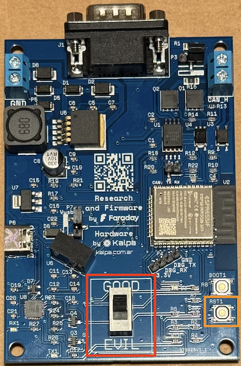
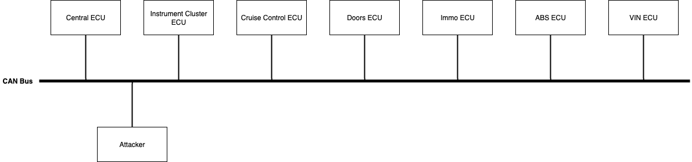
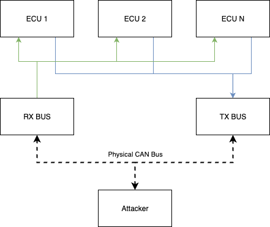

# Get started
This workshop has several challenges of increasing difficulty. For the first two you have to use Doggie and for the rest evilDoggie. The last challenge requires the ["Force"](/software/evil_doggie/force) feature and can only be solved using Faraday's board ([Force hardware implementation](/hardware/force)).

If you are using a custom board you'll have to flash the corresponding firmware for each challenge. Please check the specific section depending on your choice of microcontroller: [ESP32](/hardware/diy/esp32/), [RP2040](/hardware/diy/rp/), or [STM32F1](/hardware/diy/bluepill/).

On the other hand, Faraday's board has the capability of booting two different firmwares. It should be already flashed, but if you need to re-flash it or update the firmwares, please refer to [this section](/hardware/faraday/). The switch labeled with **"GOOD"** and **"EVIL"** is used to select the mode in which the board will boot. GOOD for Doggie and EVIL for evilDoggie. Note that you will need to reboot the board after switching modes if it is already powered.

<figure align="center">
    
</figure>

Before doing this workshop you should follow the corresponding sections for getting started with [Doggie](/software/doggie/get_started/) and [evilDoggie](/software/evil_doggie/get_started/)

## How does this workshop work?
In this workshop, you’ll face CAN Bus challenges that recreate the essence of real-world scenarios. The challenges are implemented in a simulator we built to keep things practical, fun, and focused on CAN protocol security rather than complex car engineering.

The simulator presents a simple fictional car with only one CAN Bus. While it’s far from a real car’s complexity, it was carefully designed to help you learn how attacks work on real automotive networks.

The simulator emulates 7 ECUs (Electronic Control Units), each with its role, all communicating on the same CAN Bus:

| ECU | Function |
| ----------- | ----------- |
| Central ECU |Controls engine logic, status reporting, airbag liveness check, and other global functions. |
| Instrument Cluster ECU |Main user interface: displays car state and includes buttons to lock/unlock doors, start the engine, etc. |
| Cruise Control ECU | Manages speed setting, communicating with the Central ECU in a control loop.|
| Doors ECU | Locks/unlocks doors, and reports door status back to the Instrument Cluster ECU. |
| ABS ECU | Sends a liveness message when the ABS is working. |
| Immo ECU | Checks if the car can start the engine (e.g., simulates key inserted state). |
| VIN ECU |  Speaks ISO-TP to provide the car’s VIN number, like a real OBD2 port. |

As an attacker, you will connect Doggie or EvilDoggie to the bus to complete the challenges:

<figure align="center">
    
</figure>

As the attacks covered by evilDoggie target physical bus characteristics, there needs to be a real CAN bus where an attacker can connect. The original setup uses two Doggies to expose the CAN messages sent by all the simulated ECUs:

- TX Doggie: Sends all simulator-generated CAN traffic onto the real bus

- RX Doggie: Receives those messages back into the simulator

But you can also use any pair of can-utils compatible CAN adapters. This setup ensures that every ECU-to-ECU message travels on the physical CAN Bus without using a Doggie for each ECU! And then, as an attacker, you can connect your own evilDoggie and make an online attack, just like on a real car.

<figure align="center">
    
</figure>

For more instruction on how to setup and launch the workshop, please refer to [this repo](https://github.com/infobyte/doggie_workshop)
