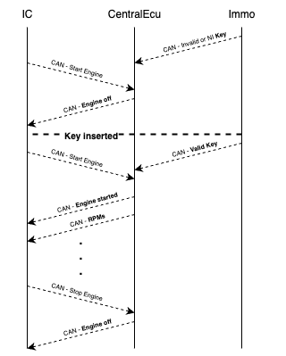
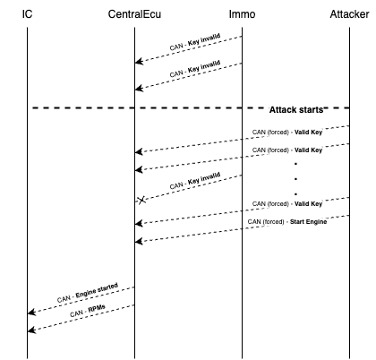
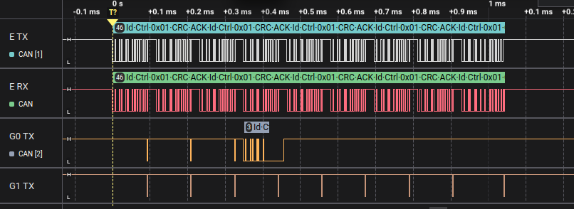
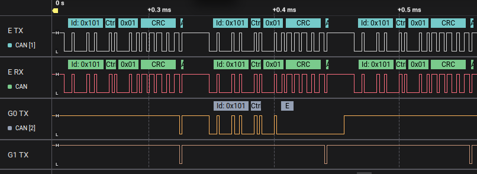
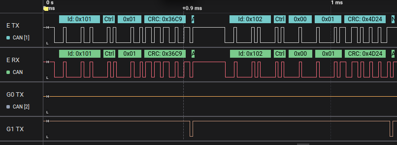

# Starting the Car without the Key
In this last challenge, your mission is to do what should never be possible: start the car’s engine without having the key inserted. The car’s security system is designed so that the engine can’t start unless the Immo ECU reports the key is present. You’ll use a unique feature of evilDoggie called force to override the messages that report the key status at the physical level. This will trick the Central ECU into thinking the key is inserted, and then you’ll send the command to start the engine.

## Hints
To understand why this is possible, let’s look at two things: how the ignition system works and what the force feature does.

### How the ignition system works:

- The Immo ECU has a toggle button that simulates the key being inserted or removed.
- It sends periodic *KeyMessage* frames:
    - CAN ID: 0x101
    - Data: one byte, non-zero if the key is inserted.
- The Central ECU checks these messages to know if the key is in.
- When the driver presses the ignition button on the Instrument Cluster, the Instrument Cluster ECU sends an *EngineControlMessage*:
    - CAN ID: 0x101
    - Starts with 0 in the first byte and the second byte is non-zero to start the engine, or 0 to stop it.
- The Central ECU verifies that the key is inserted before starting the engine.
- Finally, the Central ECU sends *EngineStatusMessage* (CAN ID 0x100) to show on the dashboard whether the engine is on.

Without the key, pressing the ignition button won’t work because the Central ECU ignores the start command.

<figure align="center">
    
</figure>

### What is the force feature?

In CAN Bus, bits can be dominant (0) or recessive (1). A dominant bit always wins over a recessive one. Physically, CAN HIGH and CAN LOW lines are driven to different voltages to create this effect. For more information on this, check the appendix on CAN protocol at the end of this guide.

EvilDoggie’s force mode (also called dominant-override) can:

- Take control of the bus.
- Force recessive bits even when other ECUs try to send dominant bits.
- This lets us inject a message in a way that other ECUs can’t override, effectively controlling what appears on the bus at the physical level.

This keeps the Immo ECU from sending “key not present” messages and at the same allows EvilDoggie to send forged “key is present” messages, followed by a start command.

<figure align="center">
    
</figure>

## Solution
We’ll build a custom attack in EvilDoggie using the force feature.

Enter the custom attack menu:

`> custom_attack`

First, wait until the bus is free (so we don’t corrupt any messages that are mid-transmission):

`custom_attack> wait_bus_free`

Next, we send multiple forced messages pretending to come from the Immo ECU, all reporting that the key is present. These messages must use force so that even if the real Immo ECU tries to say the opposite, it’s overridden.

`custom_attack> send_msg 0x101 0x1 --force`

We add this command eight times (you can reuse the last command by pressing the up arrow). Finally, we send a message pretending to come from the Instrument Cluster ECU to start the engine:

`custom_attack> send_msg 0x102 0x0,0x1 --force`

To check your attack plan, type:

`custom_attack> list`

When you’re done, save and exit the custom attack menu:

`custom_attack> save`
`custom_attack> exit`

Back in the main menu, run the attack:

`> attack`

We don’t need extra arguments; running once is enough.

If it works, you’ll see that the engine starts even though the key toggle in the Immo ECU is off. On the dashboard, the engine is running, showing that the attack succeeded.

Congratulations you’ve completed the final and most advanced challenge, using evilDoggie’s physical-layer force capability to break the car’s security and start the engine without a key!

### Observe the result in the logic analyzer (optional)
Connect you logic analyzer to evilDoggie's CAN Tx and Rx pins (E TX and E RX), and to the Tx pins of the other two interfaces (G0 TX and G1  TX).

You should see the whole attack like this:

<figure align="center">
    
</figure>

evilDoggie is forcing the *KeyMessage* indicating that the key is present. Depending on the timing you might see that the Immo ECU tries to send that the key is not present. However, as the data on the RX line does not match the data its trying to send, it enters into an error state:

<figure align="center">
    
</figure>

Finally, evilDoggie sends the message to start the car:

<figure align="center">
    
</figure>

For information about CAN protocol and CAN message structure, you can check the Appendix at the end of this guide.
