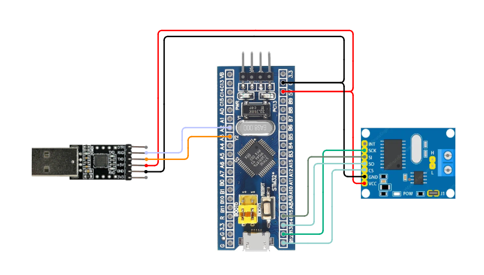
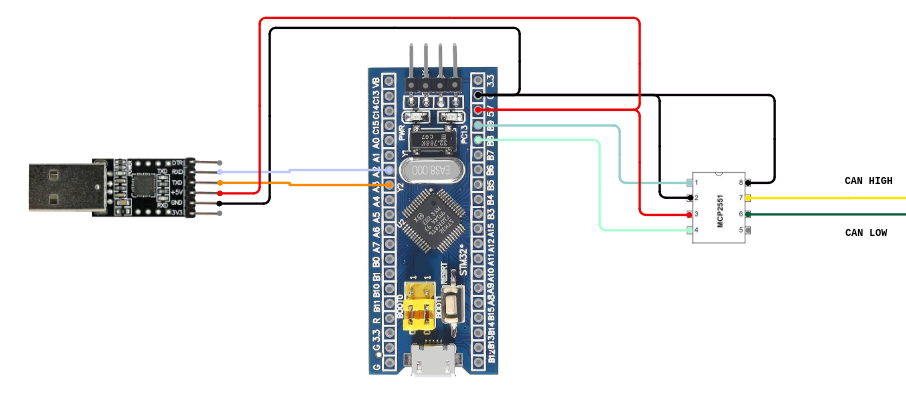

# **Doggie Bluepill**


## **Description**  
This implementation provides a **CAN Bus to USB adapter** using the **STM32F103C8** microcontroller (commonly known as **Bluepill**). It supports **three configurations** for interacting with a CAN Bus network, enabling communication via USB or UART, while leveraging different CAN transceiver options. The adapter uses the **slcan protocol** (CAN over Serial), making it compatible with popular software tools such as **SocketCAN**, **Python-can**, and other slcan-compatible applications.

---

## **Supported Configurations**

The Bluepill implementation supports the following configurations:

1. **USB and MCP2515 (SPI to CAN)**  
   - The **USB** port of the Bluepill is used for communication with the host system.  
   - The **MCP2515** (SPI to CAN) module is used for CAN Bus communication.  
   - This configuration allows the device to interface with a CAN network while communicating with the host via USB.

    __Connections__:  
    | Function | Bluepill | MCP2515 |
    | -------- | -------- | ------- |
    |   Vcc    |    5v    |    5v   |
    |   GND    |    GND   |    GND  |
    |   MOSI   |    A7    |    SI   |
    |   MISO   |    A6    |    SO   |
    |   Clock  |    A5    |    SCK  |
    |   CS     |    A4    |    CS   |

    

2. **UART and MCP2515 (SPI to CAN)**  
   - The **UART** port of the Bluepill is used to communicate with the host system.  
   - The **MCP2515** (SPI to CAN) module is used for CAN Bus communication.  
   - This configuration is useful when the USB port is unavailable or when using a serial connection instead of USB.

    __Connections__:  
    | Function | Bluepill | MCP2515 | USB-UART |
    | -------- | -------- | ------- | -------- |
    |   Vcc    |    5v    |    5v   |    5v    |
    |   GND    |    GND   |    GND  |   GND    |
    |   MOSI   |    A7    |    SI   |    -     |
    |   MISO   |    A6    |    SO   |    -     |
    |   Clock  |    A5    |    SCK  |    -     |
    |   CS     |    A4    |    CS   |    -     |
    |   TX     |    A2    |    -    |    RX    |
    |   RX     |    A3    |    -    |    TX    |   

    

3. **UART and Internal CAN Controller**  
   - The **UART** port of the Bluepill is used to communicate with the host system.  
   - The internal **CAN controller** of the STM32F103C8 microcontroller is used for CAN Bus communication and one tranceiver (MCP2551 in this case).  
   - **Note:** The Bluepill's **USB port** and **internal CAN controller** cannot be used simultaneously. If the internal CAN controller is selected, the only available communication interface with the host is **UART**.

    __Connections__:  
    | Function | Bluepill | MCP2551 | USB-UART |
    | -------- | -------- | ------- | -------- |
    |   Vcc    |    5v    |    VDD  |    5v    |
    |   GND    |    GND   |    VSS  |   GND    |
    |   CAN TX |    B8    |    TX   |    -     |
    |   CAN RX |    B9    |    RX   |    -     |
    |   RS     |    GND   |    RS   |    -     |
    |   TX     |    A2    |    -    |    RX    |
    |   RX     |    A3    |    -    |    TX    |  

    

---

## **How to Compile and Flash**

### **Prerequisites**  
1. Install **Rust** and **cargo** with support for ARM architecture.  
   Follow the installation instructions from the official [Rust website](https://www.rust-lang.org/tools/install).  


2. Add the target architecture:
    ```
    rustup target add thumbv7m-none-eabi
    ```

3. Install `probe-rs`
    ```
    cargo install probe-rs
    ```

### **Compile and Flash the Firmware Using ST-Link V2:**

1. Connect Bluepill to the programmer  
    

2. Build and flash with selected features
    * USB and MCP2515:
        ```
        cargo run --release
        ```
    * UART and MCP2515:
        ```
        cargo run --release --no-default-features --features "uart,mcp2515"
        ```
    * UART and internal CAN:
        ```
        cargo run --release --no-default-features --features "uart,internal_can"
        ```