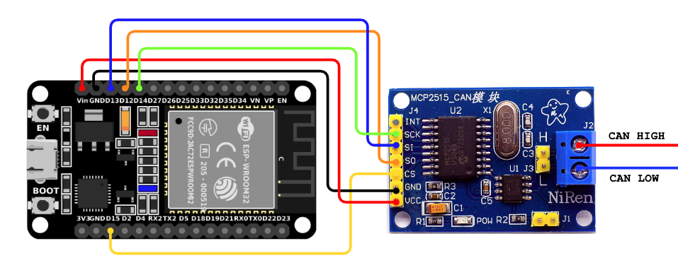

# **Doggie ESP32**


## **Description**  
This implementation provides a **CAN Bus to USB adapter** using the **ESP32** microcontroller (commonly available in devkits such as the ESP-WROOM-32 we will use as example). The adapter uses the **slcan protocol** (CAN over Serial), making it compatible with popular software tools such as **SocketCAN**, **Python-can**, and other slcan-compatible applications. Since these boards include a UART bridge connected to the UART0 peripheral, SLCAN will be available through UART0 and USB using the default configuration.

---

## **Supported Configurations**

The ESP32 implementation supports the following configuration:

1. **USB, UART0 and MCP2515 (SPI to CAN)**  
   - The **USB** port and the **UART0** port of the ESP32 can be used for communication with the host system.  
   - The **MCP2515** (SPI to CAN) module is used for CAN Bus communication.  
   - This configuration allows the device to interface with a CAN network while communicating with the host via USB.

    __Connections__:  
    | Function |   ESP32  | MCP2515 |
    | -------- | -------- | ------- |
    |   Vcc    |  VIN/5v  |    5v   |
    |   GND    |   GND    |    GND  |
    |   MOSI   |   D13    |    SI   |
    |   MISO   |   D12    |    SO   |
    |   Clock  |   D14    |    SCK  |
    |   CS     |   D15    |    CS   |

    

---

## **How to Flash a Release**
1. Install `espflash`
    ```
    cargo install espflash
    cargo install cargo-espflash
    ```
2. Download the release `doggie_esp32`.
3. Run `espflash flash --monitor -L defmt doggie_esp32`
 
## **How to Compile and Flash**

### **Prerequisites**  

1. Install **Rust** and **cargo** with support for ARM architecture.  
   Follow the installation instructions from the official [Rust website](https://www.rust-lang.org/tools/install).  


2. Install `ldproxy`, `espup` and the ESP32 toolchain:
    ```
    cargo install ldproxy
    cargo install espup
    espup install
    . $HOME/export-esp.sh           # Or add to .zshrc/.bashrc
    ```

3. Install `espflash`
    ```
    cargo install espflash
    cargo install cargo-espflash    # Optional espflash cargo command
    ```

### **Compile and Flash the Firmware**

1. Connect ESP32 to the PC via USB

3. Build and flash:
    ```
    DEFMT_LOG=off cargo run --release
    ```
