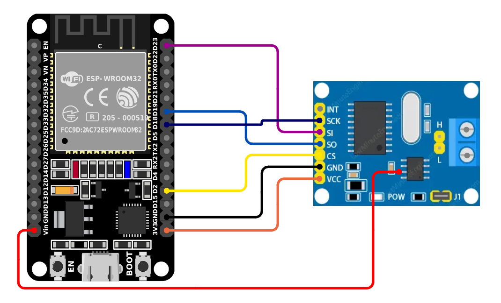
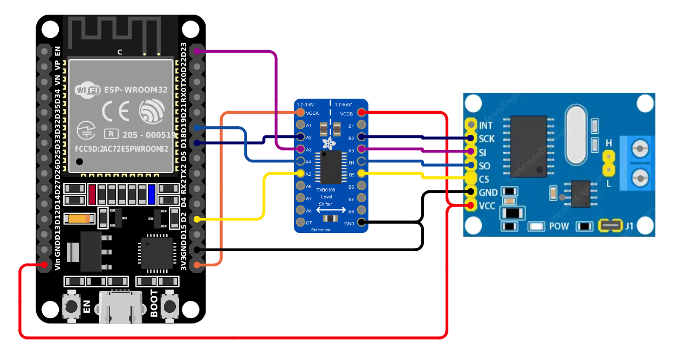
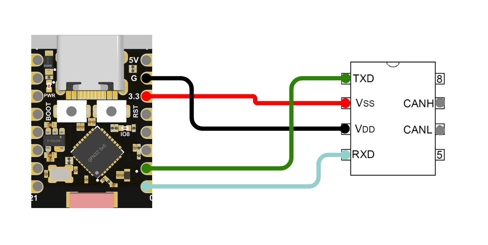

# **Doggie ESP32**


## **Description**  
This implementation provides a **CAN Bus to USB or BLE adapter** using the **ESP32** microcontroller (commonly available in devkits such as the ESP-WROOM-32 we will use as example). The adapter uses the **slcan protocol** (CAN over Serial), making it compatible with popular software tools such as **SocketCAN**, **Python-can**, and other slcan-compatible applications. Since these boards include a UART bridge connected to the UART0 peripheral, SLCAN will be available through UART0 and USB using the default configuration.

---

## **Supported Configurations**

The ESP32 implementation supports the following configurations.

As the ESP32 doesn't have 5v tolerant GPIOs, we should modify the MCP2515 or use a logic level shifter in order to make it compatible. Read [MCP2515 module compatibility note](../docs/mcp_mod.md) for more information.

1. **USB, UART0 or BLE, and MCP2515 (SPI to CAN)**  
   - The **USB** port, the **UART0** port and the BLE of the ESP32 can be used for communication with the host system.  
   - The **MCP2515** (SPI to CAN) module is used for CAN Bus communication.  
   - This configuration allows the device to interface with a CAN network while communicating with the host via USB or BLE.

    __Connections__ (MCP2515 mod):  
    | Function |    MCP2515     |
    | -------- | -------------- |
    |   Vcc 3.3|       VCC      |
    |   Vcc 5v | Tranceiver Vcc |
    |   GND    |       GND      |
    |   MOSI   |       SI       |
    |   MISO   |       SO       |
    |   Clock  |       SCK      |
    |   CS     |       CS       |

    

    __Connections__ (MCP2515 with level shifter):  
    | Function | Level Shifter | MCP2515 |
    | -------- | ------------- | ------- |
    |   Vcc    |        -      |    5v   |
    |   GND    |        -      |    GND  |
    |   MOSI   | <-----------> |    SI   |
    |   MISO   | <-----------> |    SO   |
    |   Clock  | <-----------> |    SCK  |
    |   CS     | <-----------> |    CS   |

    


2. **USB, UART0 or BLE, and TWAI (Internal controller)**  
   - The **USB** port, the **UART0** port and the BLE of the ESP32 can be used for communication with the host system.  
   - The TWAI controller is used for CAN Bus communication.  
   - This configuration allows the device to interface with a CAN network using only a transceiver while communicating with the host via USB or BLE.

    

    __Connections__ (MCP2515 mod):  
    | Function |   Tranceiver   |
    | -------- |--------------- |
    |   Vcc    |       VCC      |
    |   GND    |       GND      |
    |    TX    |       TX       |
    |    RX    |       RX       |


    For each esp32 varian we will use different pins that are defined but they could be easily changed in the code. Some variants are not implemented but are compatible and will be implemented on demand.

   __Connections variants__: 
    | Function  |   ESP32  | ESP32c3  |
    | ----------- | -------- | -------- |
    |    Vcc 3.3  |   3v3    |    3.3   |
    |    Vcc 5v   |  VIN/5v  |    5v    |
    |    GND      |   GND    |     G    |
    |    MOSI     |   D13    |     6    |
    |    MISO     |   D12    |     5    |
    |    Clock    |   D14    |     9    |
    |    CS       |   D15    |     7    |
    |    CAN TX   |   D4     |     1    |
    |    CAN RX   |   D3     |     0    |
    | LOGS (UART) |   D10    |     3    |
---

## **Notes on debugging**

The UART-USB or SerialJtagUsb bridge of the esp32 is usually used to flash, write logs and debugging, but as we will be using it as a serial interface for CAN Bus, we need another way to log and debug. For that we set up another UART interface that will print logs. In the "Connections Variants" table we could find the corresponding UART TX pins as **LOGS**.


## **How to Flash a Release**
1. Install `espflash`
    ```
    cargo install espflash
    cargo install cargo-espflash
    ```
2. Download the release `doggie_esp32`.
3. Run `espflash flash --monitor -L defmt doggie_esp32`
 
## **How to Compile and Flash**

### **Prerequisites**  

1. Install **Rust** and **cargo** with support for ARM architecture.  
   Follow the installation instructions from the official [Rust website](https://www.rust-lang.org/tools/install).  


2. Install `ldproxy`, `espup` and the ESP32 toolchain:
    ```
    cargo install ldproxy
    cargo install espup
    espup install --toolchain-version 1.82.0.1
    . $HOME/export-esp.sh           # Or add to .zshrc/.bashrc
    ```

3. Install `espflash`
    ```
    cargo install espflash
    cargo install cargo-espflash    # Optional espflash cargo command
    ```

### **Compile and Flash the Firmware**

First we have to choose witch firmware variant we want to use. All the variants starts a BLE server and the USB port, so they will wait for data to select witch one to use. There are three variants:

* **doggie_esp32_twai**: This variant will use only the TWAI controller.
* **doggie_esp32_mcp**: This variant will use the MCP2515 with the SPI interface.
* **doggie_esp32**: This variant will check if the MCP2515 is connected, if it is not connected it will use the TWAI controller. This version has a little overhead and is not the most robust.

We need to select the used board (**esp32**, **esp32c3**, etc).

1. Connect ESP32 to the PC via USB

3. Build and flash:
    ```
    DEFMT_LOG=off cargo {BOARD} --bin {VARIANT}
    ```

    For example:
    ```
    DEFMT_LOG=off cargo esp32c3 --bin doggie_esp32
    ```
