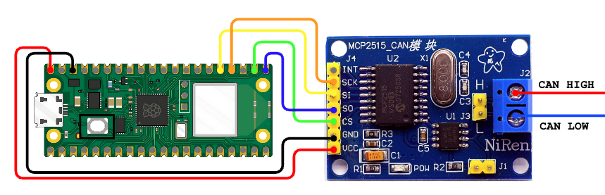
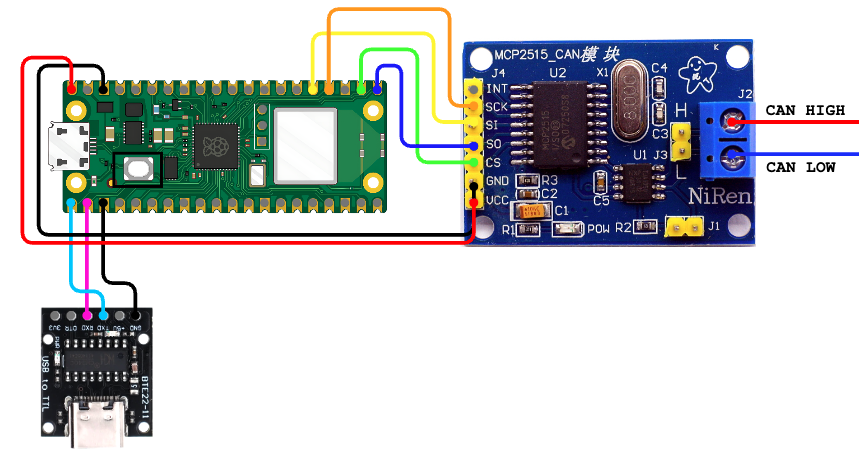
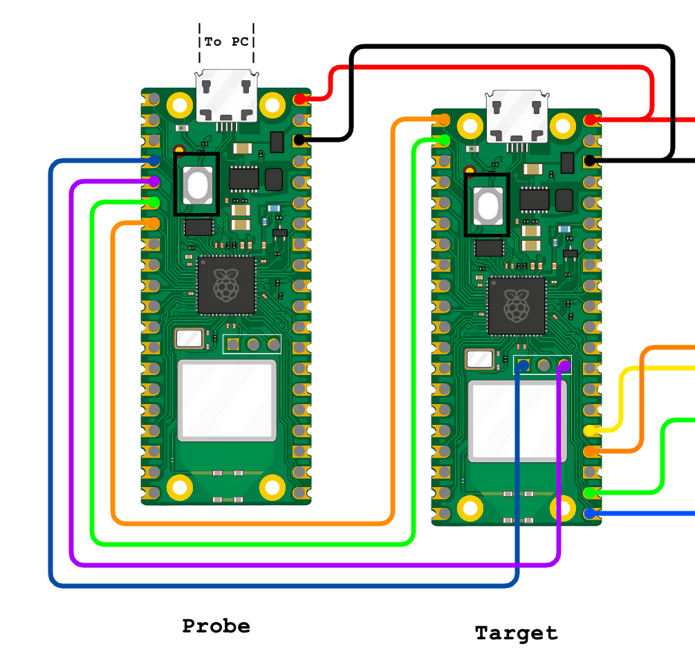

# **Doggie Pico**


## **Description**  
This implementation provides a **CAN Bus to USB adapter** using the **RP2040** microcontroller (commonly known as **Raspberry Pico** or **Raspberry Pico W**). It supports **two configurations** for interacting with a CAN Bus network, enabling communication via USB or UART. The adapter uses the **slcan protocol** (CAN over Serial), making it compatible with popular software tools such as **SocketCAN**, **Python-can**, and other slcan-compatible applications.

---

## **Supported Configurations**

The Raspberry Pico implementation supports the following configurations:

1. **USB and MCP2515 (SPI to CAN)**  
   - The **USB** port of the Pico is used for communication with the host system.  
   - The **MCP2515** (SPI to CAN) module is used for CAN Bus communication.  
   - This configuration allows the device to interface with a CAN network while communicating with the host via USB.

    __Connections__:  
    | Function |   Pico   | MCP2515 |
    | -------- | -------- | ------- |
    |   Vcc    |   VBUS   |    5v   |
    |   GND    |   GND    |    GND  |
    |   MOSI   |   GP19   |    SI   |
    |   MISO   |   GP16   |    SO   |
    |   Clock  |   GP18   |    SCK  |
    |   CS     |   GP17   |    CS   |

    

2. **UART and MCP2515 (SPI to CAN)**  
   - The **UART** port of the Pico is used to communicate with the host system.  
   - The **MCP2515** (SPI to CAN) module is used for CAN Bus communication.  
   - This configuration is useful when the USB port is unavailable or when using a serial connection instead of USB.

    __Connections__:  
    | Function |   Pico   | MCP2515 | USB-UART |
    | -------- | -------- | ------- | -------- |
    |   Vcc    |   VBUS   |    5v   |    5v    |
    |   GND    |   GND    |    GND  |   GND    |
    |   MOSI   |   GP19   |    SI   |    -     |
    |   MISO   |   GP16   |    SO   |    -     |
    |   Clock  |   GP18   |    SCK  |    -     |
    |   CS     |   GP17   |    CS   |    -     |
    |   TX     |   GP0    |    -    |    RX    |
    |   RX     |   GP1    |    -    |    TX    |   

    

---

## **How to Compile and Flash**

### **Prerequisites**  


probe-rs (para programar con otra pico):
curl --proto '=https' --tlsv1.2 -LsSf https://github.com/probe-rs/probe-rs/releases/latest/download/probe-rs-tools-installer.sh | sh

1. Install **Rust** and **cargo** with support for ARM architecture.  
   Follow the installation instructions from the official [Rust website](https://www.rust-lang.org/tools/install).  


2. Add the target architecture:
    ```
    rustup target add thumbv6m-none-eabi
    ```

3. To program a Pico, you can put it in bootloader mode and copy the firmware or use another Pico as a probe.

- If you want to program your Pico by copying the firmware, install `elf2uf2-rs`:
    ```
    cargo install elf2uf2-rs
    ```

- If you want to program your Pico using another Pico as a probe, install `probe-rs`:
    ```
    curl --proto '=https' --tlsv1.2 -LsSf https://github.com/probe-rs/probe-rs/releases/latest/download/probe-rs-tools-installer.sh | sh
    ```

    Additionally, you have to modify `doggie_pico/.cargo/config.toml`:
    ```
    [target.'cfg(all(target_arch = "arm", target_os = "none"))']
    # runner = "elf2uf2-rs -d"
    runner = "probe-rs run --chip RP2040"

    [build]
    target = "thumbv6m-none-eabi"        # Cortex-M0 and Cortex-M0+

    [env]
    DEFMT_LOG = "trace"
    ```

    And setup a Pico as a probe by cloning the [RPI debug probe repo](https://github.com/raspberrypi/debugprobe), building it for the pico:
    ```
    git clone https://github.com/raspberrypi/debugprobe.git
    cd debugprobe
    mkdir build
    cd build
    cmake -DDEBUG_ON_PICO=ON ..
    make
    ```
    Copying the resulting `.uf2` image to the Pico, and connecting it to the target Pico.
    
     __Connections__:  
    | Function |   Pico Probe   | Target Probe |
    | -------- | -------------- | ------------ |
    |  Vcc     |      VBUS      |     VBUS     |
    |  GND     |      GND       |     GND      |
    |  SWCLK   |      GP2       |     SWCLK    |
    |  SWDIO   |      GP3       |     SWDIO    |
    |  UART -> |      GP4       |     GP1      |
    |  UART <- |      GP5       |     GP0      |

    

    Note that you will be using the probe as a SWD programer and as a UART bridge, so you must compile doggie using the `uart` feature.


### **Compile and Flash the Firmware:**

1. Connect the target Pico to the PC in bootloader mode or to the probe as shown before.  

2. Build and flash with selected features
    * USB and MCP2515:
        ```
        cargo run --bin doggie_pico_usb_mcp --release
        ```
    * UART and MCP2515 (Use this feature if you are using the probe):
        ```
        cargo run --bin doggie_pico_uart_mcp --release
        ```
